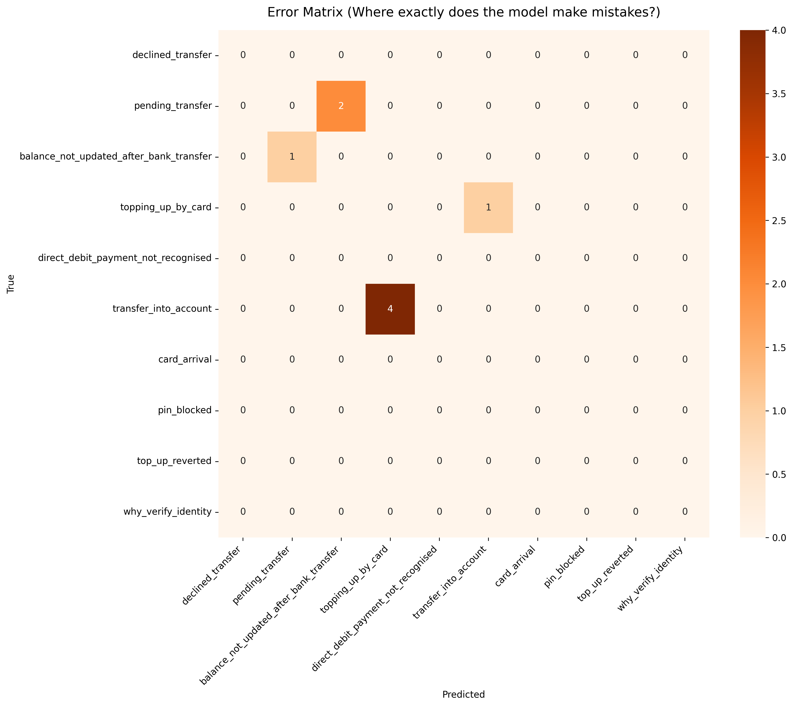
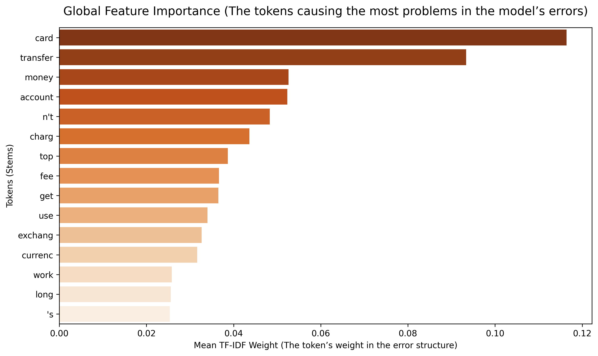

# 🏦 Intent Classification Service for Fintech Support (Banking77)

A project to develop, optimise and deploy a production web service for the automatic classification of user intent in the fintech sector. The service is built using modern natural language processing (NLP), deep learning and containerisation techniques.

---

## 🎯 1. Analysis of job profiles and business objectives

### 💼 Market Alignment
Before the project began, three current job vacancies for the role of **NLP / Machine Learning Engineer (Middle)** in FinTech and AI products were analysed:
1. **ML Engineer (Fintech/Banking):** Requirements — experience in classifying text streams, working with Transformers (BERT, RoBERTa), optimising inference for low latency.
2. **Data Scientist (NLP Product):** Requirements — building semantic search systems using embeddings (Sentence Transformers) and PyTorch, and deploying models via REST API.
3. **Machine Learning Engineer (AI Customer Support):** Requirements — automating first-line support, analysing user logs, working with custom neural network architectures.

### 📈 Business objective of the project
In the real-world banking sector, thousands of customer enquiries are received every day. Manually sorting messages places a heavy burden on support teams, slows down response times and increases operational costs.
**Project objective:** To create a scalable, lightweight REST API service capable of instantly identifying one of the user’s **77 financial intents**, enabling requests to be automatically routed to the relevant specialists or to chatbots.

---

## 📊 2. Exploratory Data Analysis (EDA)

A specialised banking dataset, **Banking77 (MTEB)**, was used for this study.

### 🔍 Key data characteristics:
* **Structure and volume:** The dataset contains **9,993** training and **3,076** test user queries, distributed across 77 classes.
* **Data quality:** Checks revealed a complete absence of missing values (`NaN`) and duplicates in the text across both datasets.
* **Linguistic metrics (Word Count):**
  * The average length of a client query in the training set is **~11.95 words** (median — 10), and in the test set — **~10.96 words** (median — 9).
  * The minimum query length is 3 words, the maximum is 79 words.
  * Based on this, the tokenisation limit is set to `max_length=64`, which covers over 99% of the length distribution and eliminates excessive padding.

### 📐 Data Splitting:
To prevent data leakage and ensure accurate model evaluation, the training set is dynamically split into subsets:
* **Train Set:** 7,994 rows (80% of the original training set)
* **Validation Set:** 1,999 rows (20% of the original training set)
* **Test Set:** 3,076 rows (final independent validation)

---

## 🛠️ 3. Solution approach and tools

The models were trained and evaluated using the **Banking77** dataset, which contains **9,993** training (`train`) and **3,076** test (`test`) examples, distributed across 77 classes. The project employs an iterative engineering approach: from the simplest statistical models to modern neural networks:
1. **Tokenisation and vectorisation:** A combination of sparse frequency features (`TF-IDF Vectorizer`) with stemming was used, along with dense semantic vectors of fixed dimension (`384`) based on the `all-MiniLM-L6-v2` transformer.
2. **Evaluation:** **`Test F1 (Macro)`** was chosen as the primary metric, as it objectively assesses the model’s quality across each of the 77 classes, regardless of any potential class imbalance. Secondary metrics include `Weighted F1` and `ROC-AUC`.
3. **Technology stack:** Python 3.12, PyTorch, Sentence Transformers, Hugging Face `transformers` (RoBERTa), CatBoost, Scikit-Learn, Optuna, FastAPI, Docker.

---

## 🏆 4. Experiment results (Model table)

All metrics were automatically logged to the file `../data/metrics_registry.csv` during training. The summary table of experiments, sorted by the key quality metric:

| No. | Model | Architecture / Hyperparameters | Train F1 (Macro) | Val F1 (Macro) | Test F1 (Macro) | Training time |
|---|---|---|---|---|---|---|
| 1 | **BERT (RoBERTa)** | RobertaForSequenceClassification (124.7M params), AdamW | 0.9911 | 0.9177 | **0.928** | 693.5 sec |
| 2 | **MLP (Sentence Transformers)** | IntentMLP (961.6k params), Embeddings: 384, Agent: AdamW | 0.9736 | 0.9232 | **0.9265** | **2.2 sec** |
| 3 | **MLP (TF-IDF)** | IntentMLP (5.5M parameters), Inputs: 4,834, AdamW | 0.9694 | 0.8453 | **0.8607** | 3.6 sec |
| 4 | **CatBoost (TF-IDF)** | depth: 5, lr: 0.149, l2_leaf_reg: 0.149 (Optuna tuned) | 0.9885 | 0.8455 | **0.8459** | 132.6 sec |
| 5 | **Logistic Regression (TF-IDF)** | Baseline, C=1.0, penalty='l2' | 0.9168 | 0.8349 | **0.8341** | 0.6 sec |

---

## 🔍 5. In-depth analysis of results and errors (error analysis)

Rather than treating the models as ‘black boxes’, an automated analysis was carried out on 221 errors made by the architecture with the best results during testing:

1. **Semantic tagging conflicts (label noise):**
   * The model frequently confuses `declined_transfer` and `declined_card_payment`. Analysis of real-world texts revealed ambiguity: for a user query such as *‘How can I resolve the issue with my card? It has been declined twice’*, the model correctly predicts a card payment, even though the dataset contains the ‘transfer’ label. In other words, errors are often caused by the subjectivity of the initial labelling.



2. **Analysis of trigger lexical units (importance of error features):**
   * A TF-IDF analysis conducted on a subset of errors revealed that the main triggers are the words **`card`**, **`transfer`**, **`money`** and **`account`**. These words are too general and create semantic noise, leading to misclassification by the model into adjacent support categories.



---

## 💡 6. Engineering findings and business impact

1. **Speed versus quality trade-off:** Full fine-tuning of RoBERTa yielded the highest accuracy (`0.928`), but it is too resource-intensive for free hosting. The hybrid **Sentence Transformer + MLP** approach lags by just **0.08%** in relative accuracy, but trains in **2.2 seconds** and consumes minimal RAM.
2. **Deployment solution:** The `Sentence Transformer + MLP` combination was selected for production on Render. It enables instant inference on the CPU and protects the container from crashing due to RAM limitations (Out-of-Memory).
3. **Model limitations:** The current model is sensitive to very short and ambiguous phrases lacking context.
4. **Areas for improvement:** Implementing Active Learning mechanisms for further training on real user logs and cleaning up noise in the Banking77 annotation data.

---

## 🚀 7. Instructions for running and using the project locally

### 📋 Prerequisites
The project is split into two dependency files to optimise the environment:
* `requirements-dev.txt` — contains heavy libraries for research, model training, analysis and EDA (*PyTorch, Transformers, CatBoost, Optuna*).
* `requirements.txt` — contains only the lighter product packages required for deployment and running the REST API (*FastAPI, PyTorch, Uvicorn, Sentence-Transformers*).

### 💻 1. Running the FastAPI service locally
1. Clone the repository and navigate to the project root.
2. Install the product dependencies for deployment:
   ```bash
   pip install -r requirements.txt
   ```
3. Start the FastAPI web server:
   ```bash
   uvicorn app:app --reload --host 0.0.0.0 --port 8000
   ```
4. Open the Swagger API interactive documentation in your browser to test endpoints in real time:
   ```text
   http://localhost:8000/docs
   ```

---

## 🐳 8. Containerisation and cloud deployment (Render)

To ensure complete isolation of the runtime environment and stable hosting, the project has been containerised and deployed on the **Render** platform using Docker.

### ⚙️ Dockerfile specification
* **Base image:** The official `python:3.12-slim` image is used to minimise the size of the final image.
* **Ports:** Unlike Hugging Face Spaces, which has fixed settings, Render requires the application to listen on host `0.0.0.0` and a dynamic port, which is automatically passed by the platform via the `PORT` environment variable (by default, the code is configured to use port **`8000`** as a fallback).
* **File exclusion:** The `.dockerignore` file excludes heavy local data (`.csv`), cache (`__pycache__`) and Jupyter notebooks from the build context to keep the image lightweight.

### 🛠️ Commands for local build and run
Building the project’s Docker image:
```bash
docker build -t banking-intent-api .
```

Running locally with port forwarding to Render (8000):
```bash
docker run -p 8000:8000 banking-intent-api
```
Once the commands have been executed, the service will automatically start inside the container and will be accessible at: `http://localhost:8000/docs`.

---

## 🌐 9. Cloud deployment

The final version of the REST API has been deployed as a **Render service** of the Docker Space type, with automatic redeployment on every push to the Render Git repository.

* 🔗 **Link to the live API:** `https://banking77-intent-classification.onrender.com/docs`

### 🧠 Infrastructure Features & Optimization

The service is deployed on the **Render Free Tier**, which provides a highly constrained environment: **512 MB RAM and 0.1 vCPU** (shared). In such a resource-limited infrastructure, traditional NLP deployment methods would instantly fail due to Out-of-Memory (OOM) errors. 

To overcome these strict hardware bottlenecks, the project relies on heavy engineering optimizations:
* **Hybrid Light Architecture:** Deploying a compact `IntentMLP` head on top of pre-computed `SentenceTransformer` embeddings, keeping the runtime signature minimal.
* **Memory-Centric Pipeline:** Utilizing the custom `SparseDataset` wrapper to stream batches lazily, eliminating the massive RAM overhead caused by standard dense matrix expansions (`.toarray()`).

As a result, the application demonstrates exceptional resource efficiency, preventing OOM crashes even within Render's tight 512 MB boundary while ensuring responsive inference latency.

---

## 🎯 Key Takeaways for Recruiters

This project demonstrates the full development cycle of an ML product (Production-ready ML) and confirms the following competencies:

1. **In-depth understanding of architectures (NLP & Deep Learning):** A complete NLP pipeline has been implemented, ranging from baseline linear models and gradient boosting (CatBoost) to neural networks (MLP) and heavy transformers (`RoBERTa`), resulting in a **+9.35% F1** quality improvement compared to the baseline.
2. **Engineering trade-offs and optimisation (Speed vs Accuracy):** An efficient `Sentence Transformer` + `MLP` combination has been designed. This resulted in **an inference speed-up of ~315 times** compared to a heavy transformer, at the cost of only 0.08% accuracy, making it an ideal solution for the free Render CPU service.
3. **Deep Error Analysis:** A detailed audit of the models’ performance was carried out: **221 classification errors** were categorised and interpreted (analysis of class mixing and dataset ambiguity), demonstrating the ability to work with data quality rather than merely focusing on general metrics.
4. **Development of a Production-grade API:** The model has been wrapped into a fully-fledged web service based on `FastAPI`, with input data validation via `Pydantic` schemas, protection against `KeyError` and memory leaks (`SparseDataset`), and is fully ready for deployment via **Docker** and CI/CD environments.